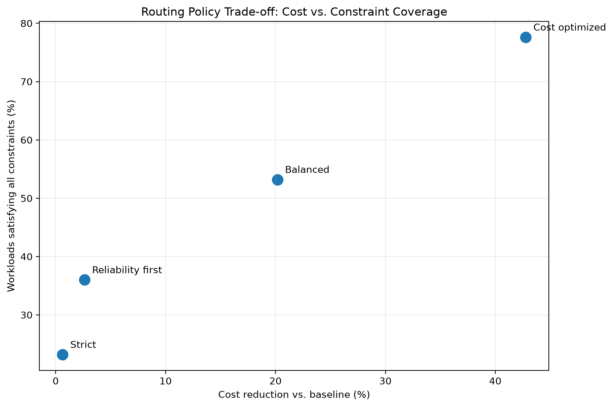
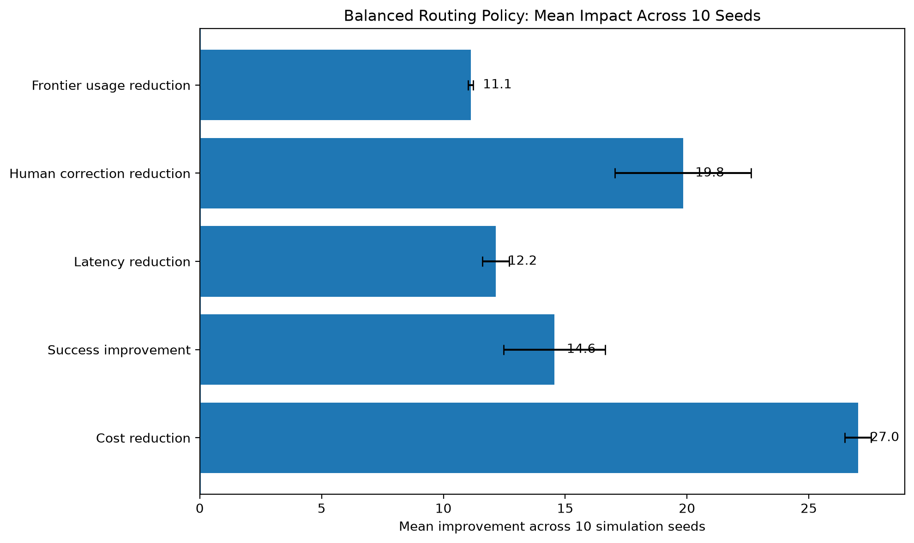
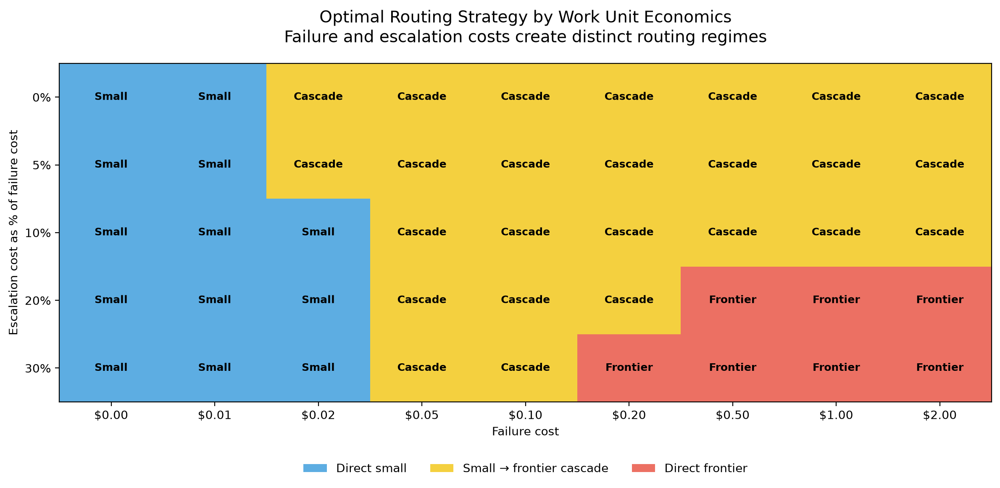
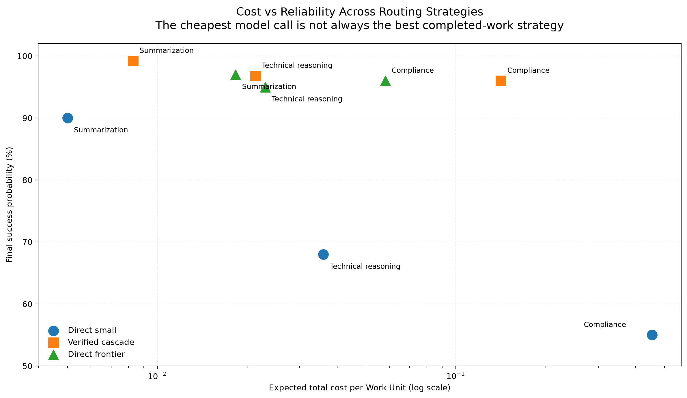
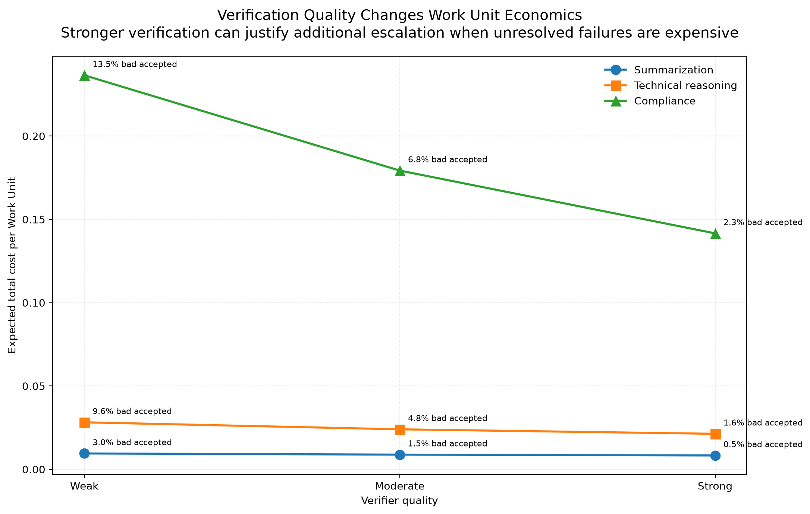
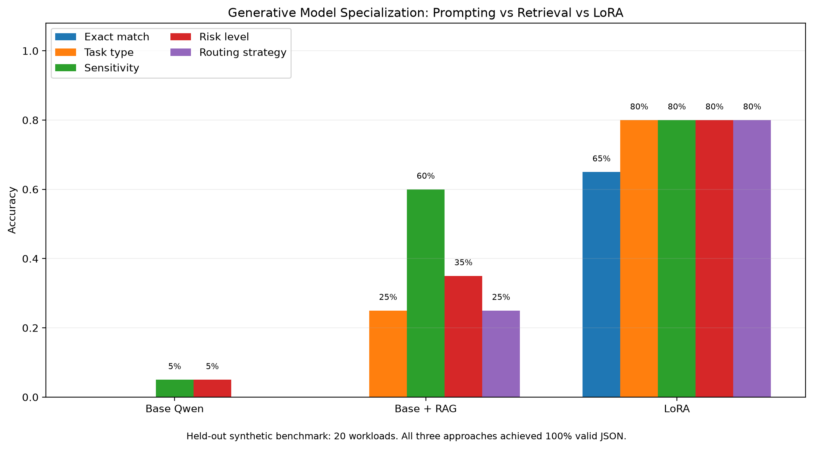
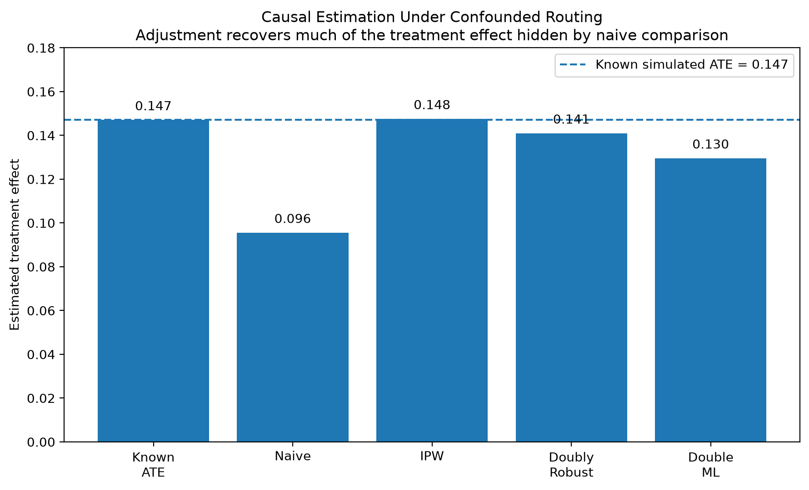
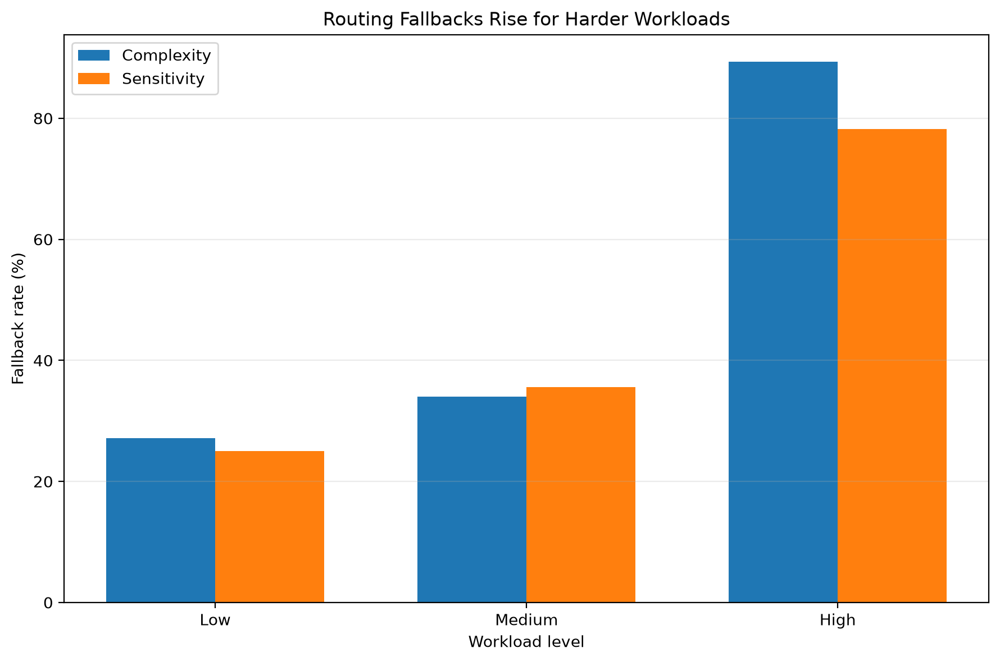

# Enterprise AI Workload Intelligence

A simulation and evaluation framework for workload-aware routing of enterprise AI tasks across heterogeneous tools under cost, quality, reliability, latency, sensitivity, verification, and failure-risk constraints.

Rather than assuming one model or tool should handle every enterprise workload, this project asks:

> **Given a specific workload and its operational requirements, which available AI tool should handle it?**

The framework extends that question further:

> **When should an enterprise AI system use a cheaper model first and escalate, and when is it more efficient or safer to route directly to a stronger model?**

The project combines workload simulation, counterfactual evaluation, constraint-aware routing, Work Unit economics, verification, retrieval and semantic reranking, faithfulness evaluation, regression testing, fine-tuning, causal experimentation, and production-system reasoning.

The core routing experiments use **simulated tool classes and synthetic workload outcomes**. They are not empirical benchmarks of ChatGPT, Claude, Codex, or any other provider.

Separate model experiments use pretrained open models for retrieval, faithfulness evaluation, encoder fine-tuning, and generative LoRA adaptation.

## Live Deployment

The routing API is containerized with Docker and deployed as a public FastAPI service on Render.

- **Live API:** https://enterprise-ai-workload-intelligence.onrender.com
- **Interactive API Docs:** https://enterprise-ai-workload-intelligence.onrender.com/docs
- **Health Check:** https://enterprise-ai-workload-intelligence.onrender.com/health

The deployed API exposes the workload-routing interface. Core routing benchmark outcomes remain simulation-based; the production path would replace synthetic tool-performance assumptions with observed telemetry collected through shadow traffic and controlled rollout.

---

## Research Questions

This project investigates several related questions:

1. Can workload-aware routing outperform static model allocation?
2. How should cost, quality, latency, reliability, and human correction be traded off?
3. When do stricter routing constraints improve outcomes, and when do they simply increase fallback?
4. Should routing optimize inference cost or the expected cost of completing a Work Unit?
5. When is cheap-first escalation preferable to direct frontier execution?
6. How do failure cost and escalation overhead change routing decisions?
7. How stable are routing decisions under uncertainty in model performance?
8. How does imperfect verification change cascade economics?
9. Can semantic reranking improve evidence ordering when lexical retrieval already has strong coverage?
10. How should faithfulness be evaluated separately from semantic similarity?
11. How should AI-system regressions be detected across multiple operational dimensions?
12. What does fine-tuning improve, and what still requires calibration?
13. How should routing policies be evaluated through randomized experiments?
14. What happens when historical routing data is confounded and randomization is unavailable?
15. When should stable LLM behavior be fine-tuned rather than supplied through retrieval?
16. Does successful policy retrieval imply that a generative model will actually apply the policy correctly?
17. How should dynamic policy changes interact with previously fine-tuned behavior?
18. What would it take to move the framework from offline simulation into a production enterprise AI system?

Detailed answers and experiment notes are maintained in:

```text
docs/research_questions.md
```

---

## System Overview

The framework models enterprise AI as a decision system rather than a single-model application.

```text
Synthetic Enterprise Workloads
        |
        v
Observed Tool Allocation
        |
        v
Observability + Inefficiency Detection
        |
        v
Counterfactual Tool Simulation
        |
        v
Expected Outcome Estimation
        |
        v
Constraint-Aware Routing
        |
        v
Work-Unit / Failure-Aware Routing
        |
        v
Context Retrieval
        |
        v
Semantic Reranking
        |
        v
Model / Tool Execution
        |
        v
Verification + Faithfulness
        |
        +--> Accept
        |
        +--> Retry / Escalate
        |
        +--> Human Review
        |
        v
Regression Gates
        |
        v
Offline / Causal / A-B Evaluation
        |
        v
Production Monitoring + Fallbacks
```

The objective is not simply to choose the strongest model.

It is to determine the most appropriate execution strategy for a particular workload under operational and business constraints.

---

## Simulated Enterprise Workloads

Synthetic workloads represent tasks across departments such as:

- engineering
- compliance
- finance
- sales
- support
- recruiting
- marketing

Task types include:

- coding
- reasoning
- retrieval
- summarization
- generation
- classification
- extraction

Each workload contains characteristics such as:

- complexity
- sensitivity
- business priority
- assigned tool
- latency
- cost
- human correction
- task success
- quality

These features allow the framework to study how routing decisions interact with workload characteristics.

---

## Simulated Tool Portfolio

The core routing simulation models a heterogeneous portfolio containing representative tool classes such as:

- frontier conversational model
- frontier reasoning/coding model
- alternative frontier model
- small local model
- deterministic automation

Names such as ChatGPT, Claude, Codex, or local models may be used as intuitive labels for simulated tool classes.

The routing benchmark does **not** call those providers or claim to measure their real-world performance.

Instead, the simulator generates workload-dependent estimates and realized outcomes for:

- success probability
- quality
- latency
- correction burden
- execution cost

This allows routing algorithms to be studied without presenting synthetic assumptions as provider benchmarks.

Separate experiments in this repository use actual pretrained models including:

- `all-MiniLM-L6-v2`
- `facebook/bart-large-mnli`
- `distilbert-base-uncased`
- `Qwen/Qwen2.5-0.5B-Instruct`

---

## Counterfactual Evaluation

Observed enterprise telemetry only reveals the outcome of the tool that actually handled a workload.

To evaluate alternative routing decisions, the simulator creates potential outcomes for every workload-tool pair.

For 250 workloads and five simulated tools:

```text
250 workloads × 5 tools = 1,250 potential outcomes
```

Each candidate tool receives pre-decision estimates such as:

- success probability
- expected quality
- expected latency
- expected corrections
- estimated cost

Realized outcomes are generated separately and are used only for downstream evaluation.

### Preventing Outcome Leakage

An early version of the router could indirectly use realized outcome information when selecting a tool.

That creates target leakage because a real routing system cannot know the outcome of a model execution before making the routing decision.

The implementation was therefore corrected so routing decisions use only pre-decision expected quantities.

This separation is fundamental:

```text
Expected metrics
    |
    v
Routing decision
    |
    v
Execution
    |
    v
Realized outcome
```

---

## Constraint-Aware Routing

Routing policies evaluate candidate tools using requirements such as:

- minimum expected quality
- minimum success probability
- maximum latency
- maximum expected corrections
- sensitivity restrictions
- tool eligibility

If no candidate satisfies every requirement, the router explicitly records a fallback rather than pretending a feasible option existed.

Four policy configurations are evaluated:

- cost optimized
- balanced
- reliability first
- strict

Representative results:

| Policy | Cost change | Success | Quality | Latency change | Correction change | Frontier usage | Constraint satisfaction |
|---|---:|---:|---:|---:|---:|---:|---:|
| Cost optimized | -42.8% | 0.928 | 0.871 | -21.4% | -24.8% | 26.4% | 77.6% |
| Balanced | -20.2% | 0.908 | 0.860 | -9.0% | -23.3% | 36.8% | 53.2% |
| Reliability first | -2.6% | 0.904 | 0.857 | +1.1% | -27.9% | 44.8% | 36.0% |
| Strict | -0.6% | 0.904 | 0.855 | +2.0% | -26.7% | 46.0% | 23.2% |



The results illustrate that stricter constraints do not automatically improve realized outcomes.

If the available tool portfolio cannot satisfy those constraints, increasing strictness can instead increase fallback.

---

## Multi-Seed Evaluation

A single synthetic run can be sensitive to random variation.

The balanced routing policy is therefore evaluated across multiple seeds.

Across 10 representative simulation seeds, the balanced policy produced approximately:

- **20.7% average cost reduction**
- **17.6 percentage-point increase in task success**
- **0.084 increase in average quality**
- **8.4% lower latency**
- **28.3% fewer human corrections**
- **6.4 percentage-point reduction in frontier-model usage**



Confidence intervals summarize sampling variation within the simulated environment.

They should not be interpreted as uncertainty estimates for real provider performance.

---

## Work Unit Routing

Per-request inference price is not necessarily the right optimization objective.

A cheaper model can create additional downstream costs through:

- failure
- retry
- escalation
- verification
- human review
- business consequences

The project therefore introduces a **Work Unit** abstraction representing a discrete activity with an outcome and downstream cost.

A Work Unit records attributes such as:

- task type
- complexity
- sensitivity
- business value
- failure cost
- escalation cost

Three execution strategies are compared:

```text
Direct Small

Direct Frontier

Small
  |
  v
Verify
  |
  +--> Accept
  |
  +--> Escalate to Frontier
```

### Representative Workloads

The simulation includes three representative regimes:

#### Routine Summarization

Low-complexity, low-risk work.

```text
Direct small       expected cost ≈ $0.0050
Direct frontier    expected cost ≈ $0.0183
Idealized cascade  expected cost ≈ $0.0060
```

Direct-small execution is preferred when its reliability is acceptable.

#### Technical Reasoning

More difficult work where the smaller model is cheaper but substantially less reliable.

```text
Direct small       expected cost ≈ $0.0360
Direct frontier    expected cost ≈ $0.0230
Idealized cascade  expected cost ≈ $0.0178
```

A cascade can become attractive because many workloads can be handled cheaply while failures escalate.

#### Compliance

High-risk work with expensive unresolved failures.

```text
Direct small       expected cost ≈ $0.4540
Direct frontier    expected cost ≈ $0.0580
Idealized cascade  expected cost ≈ $0.1201
```

Direct-frontier execution becomes preferable because the downside of a failed first attempt dominates the inference savings.

---

## Work Unit Decision Boundaries

The project sweeps failure cost and escalation overhead to identify where the preferred routing strategy changes.



The simulation produces three broad regimes:

```text
Low failure cost
      |
      v
Direct small

Moderate failure cost
      |
      v
Small → frontier cascade

High failure / escalation cost
      |
      v
Direct frontier
```

These are grid-based simulation results rather than universal analytical thresholds.

The central result is that the cheapest model invocation is not necessarily the cheapest way to complete a Work Unit.

---

## Cost-Reliability Frontier

Routing policies can also be viewed as points on a cost-reliability frontier.



A strategy is attractive when another strategy cannot simultaneously improve reliability while lowering expected Work Unit cost.

This framing makes routing a multi-objective decision rather than a simple model-ranking problem.

---

## Routing Under Uncertainty

Estimated model success probabilities are uncertain.

The project therefore perturbs the assumed success probabilities of small and frontier models by:

```text
-0.10
-0.05
 0.00
+0.05
+0.10
```

Across the resulting 25 combinations:

```text
Summarization        Direct small in 25 / 25
Technical reasoning  Cascade in 23 / 25
Compliance           Direct frontier in 23 / 25
```

The technical-reasoning and compliance strategies each flip in two perturbation scenarios.

This experiment is a deterministic sensitivity analysis rather than a probabilistic model of uncertainty.

Its purpose is to identify routing decisions that are close to a policy boundary.

---

## Imperfect Verification

An idealized cascade assumes the system knows when the first model failed.

Real systems do not have an oracle.

The project therefore models a verifier using:

- sensitivity: probability of flagging an actual failure
- specificity: probability of accepting an actual success

Three synthetic verifier profiles are evaluated:

```text
Weak
Moderate
Strong
```

False negatives allow failed responses to pass through.

False positives unnecessarily escalate successful responses.

### Summarization

| Verifier | Accepted bad rate | Escalation rate | Final success | Expected total cost |
|---|---:|---:|---:|---:|
| Weak | 3.0% | 16.0% | 96.5% | $0.0095 |
| Moderate | 1.5% | 13.0% | 98.1% | $0.0088 |
| Strong | 0.5% | 11.3% | 99.2% | $0.0083 |

### Technical Reasoning

| Verifier | Accepted bad rate | Escalation rate | Final success | Expected total cost |
|---|---:|---:|---:|---:|
| Weak | 9.6% | 29.2% | 88.9% | $0.0282 |
| Moderate | 4.8% | 30.6% | 93.7% | $0.0240 |
| Strong | 1.6% | 31.8% | 96.8% | $0.0213 |

### Compliance

| Verifier | Accepted bad rate | Escalation rate | Final success | Expected total cost |
|---|---:|---:|---:|---:|
| Weak | 13.5% | 37.0% | 85.0% | $0.2365 |
| Moderate | 6.8% | 41.0% | 91.6% | $0.1793 |
| Strong | 2.3% | 43.8% | 96.0% | $0.1416 |



Verification quality changes both reliability and Work Unit economics.

Stronger verification reduces accepted bad responses across all three workloads, with the largest economic effect appearing in compliance because unresolved failures carry a substantially higher simulated cost.

For the strong compliance verifier:

```text
Expected inference cost:     $0.0119
Expected escalation cost:    $0.0877
Expected verification cost:  $0.0020
Expected failure cost:       $0.0400
Expected total cost:         $0.1416
```

The strong verifier causes more escalation because it catches more genuine small-model failures.

That raises execution and escalation spending.

However, the accepted bad-response rate falls from:

```text
13.5% → 2.3%
```

and expected failure cost falls enough to reduce overall expected Work Unit cost relative to weaker verifier configurations.

> **Higher model usage or escalation is not necessarily inefficient if the additional execution prevents sufficiently expensive failures.**

However, better verification does not imply that a verified cascade is the optimal routing strategy.

For compliance, the strong verified cascade still costs approximately `$0.1416`, compared with `$0.0580` for direct-frontier execution under the base assumptions.

That result reinforces the value of jointly optimizing routing and verification rather than optimizing either component independently.

---

## Retrieval and Semantic Reranking

The framework includes a small retrieval benchmark for studying how enterprise context can be selected before model execution.

The first-stage retriever uses TF-IDF lexical retrieval with unigram and bigram features. Retrieved candidates are then reranked using semantic embeddings from `all-MiniLM-L6-v2`.

The benchmark deliberately includes queries with lexical ambiguity to test whether semantic reranking can improve the ordering of retrieved candidates.

On the current five-query diagnostic benchmark:

| Metric | Lexical retrieval | Semantic reranking |
|---|---:|---:|
| Recall@3 | 1.000 | 1.000 |
| Precision@3 | 0.333 | 0.333 |
| MRR | 0.800 | 1.000 |
| Hit Rate@3 | 1.000 | 1.000 |

The semantic reranker moved the relevant document to rank one for the ambiguous cases, increasing MRR while retrieval coverage remained unchanged.

The benchmark is intentionally small and synthetic. The result demonstrates the behavior of the retrieval/reranking pipeline rather than establishing a generalized performance improvement.

---

## Faithfulness Evaluation

Retrieval quality does not guarantee that a generated answer is supported by the retrieved evidence.

The project therefore evaluates faithfulness separately.

An initial evaluator used embedding similarity to identify whether claims were supported by context. An adversarial example exposed an important failure mode: a claim could be semantically similar to the evidence while directly contradicting it.

For example, evidence describing frontier models as having higher latency could still be semantically close to a claim stating that frontier models always have lower latency.

The evaluator was therefore extended into two stages:

```text
Claim
  |
  v
Semantic Candidate Matching
  |
  v
Natural Language Inference
  |
  +--> Entailment
  +--> Neutral
  +--> Contradiction
```

The implementation uses semantic similarity for candidate evidence selection and an NLI model for entailment and contradiction detection.

This separates two different questions:

1. Is this evidence relevant to the claim?
2. Does the evidence actually support the claim?

The adversarial contradiction that passed the similarity-only evaluator is rejected by the NLI-enhanced evaluator.

---

## Regression Testing

AI-system changes can improve one metric while silently degrading another.

The project therefore includes a regression gate that compares candidate configurations against a known baseline across:

- task success
- quality
- faithfulness
- latency
- cost per request

Rather than applying one absolute tolerance to every metric, the evaluator supports metric-specific tolerances.

For example:

```text
task_success       0.02
quality            0.02
faithfulness       0.01
latency_ms         100
cost_per_request   0.002
```

This matters because a tolerance meaningful for a normalized quality score is not meaningful for milliseconds or dollar-denominated cost.

A candidate can therefore improve success, quality, and cost while still be blocked if a critical metric such as faithfulness regresses.

In the diagnostic regression suite, one candidate is rejected specifically because faithfulness declines despite improvements on several other dimensions, while another candidate passes after improving all tracked metrics beyond their configured tolerances.

The tolerance values in the repository are illustrative. In production they would be derived from service-level requirements, business risk, and empirical metric variance.

---

## Encoder Fine-Tuning Experiment

The repository includes a small transfer-learning experiment using `distilbert-base-uncased` for enterprise workload classification.

This is an encoder classification fine-tuning experiment rather than generative LLM instruction tuning.

The classifier predicts four workload categories:

- general
- sensitive
- technical
- retrieval

The training set contains deliberately small synthetic examples so the experiment remains lightweight and reproducible locally.

A harder held-out diagnostic set contains overlapping categories such as:

- sensitive + retrieval
- technical + retrieval
- general + technical
- sensitive + summarization

Results:

| Metric | Pretrained baseline | Fine-tuned |
|---|---:|---:|
| Accuracy | 0.250 | 0.688 |
| Macro F1 | 0.105 | 0.657 |

Sensitive-workload classification showed:

```text
Precision: 1.00
Recall:    0.60
F1:        0.75
```

This is operationally important because false negatives for sensitive workloads may be more costly than ordinary classification errors.

### Confidence-Aware Evaluation

The experiment also evaluates maximum predicted probability as a confidence signal.

Average maximum-class confidence on the held-out set was:

```text
0.418
```

Using a naive confidence threshold of `0.65` would escalate all 16 held-out examples.

This demonstrates an important distinction:

> **Better classification accuracy does not imply well-calibrated confidence.**

The threshold was intentionally not tuned against the test set to manufacture a better escalation rate.

A production implementation would use separate validation data for threshold selection and would evaluate probability calibration before relying on confidence for routing or abstention.

This experiment demonstrates the fine-tuning and evaluation workflow. It is not intended as evidence of production-level classifier performance.

---

## Generative LLM Specialization: Prompting, Retrieval, and LoRA

The project separately evaluates parameter-efficient fine-tuning for a generative instruction model.

The experiment uses `Qwen/Qwen2.5-0.5B-Instruct` to map enterprise workloads into a controlled routing decision:

```json
{
  "task_type": "retrieval",
  "sensitivity": "medium",
  "risk_level": "medium",
  "recommended_strategy": "verified_cascade"
}
```

The controlled ontology contains:

- six workload types
- three sensitivity levels
- three risk levels
- three routing strategies

The synthetic benchmark contains:

```text
40 unique training examples
20 harder held-out examples
0 train/test input overlap
```

Three approaches are evaluated:

1. base Qwen with prompting
2. base Qwen with retrieved policy context
3. Qwen adapted using LoRA

### LoRA Configuration

LoRA targets the attention projections:

```text
q_proj
k_proj
v_proj
o_proj
```

with:

```text
rank:                 8
alpha:               16
dropout:           0.05
trainable params: 1,081,344
trainable share:   0.218%
```

Training loss decreased across five epochs:

```text
Epoch 1   1.4835
Epoch 2   0.4092
Epoch 3   0.3269
Epoch 4   0.2670
Epoch 5   0.2166
```

### Held-Out Results

| Metric | Base Qwen | Base + RAG | LoRA |
|---|---:|---:|---:|
| Valid JSON | 1.00 | 1.00 | 1.00 |
| Exact match | 0.00 | 0.00 | 0.65 |
| Task type | 0.00 | 0.25 | 0.80 |
| Sensitivity | 0.05 | 0.60 | 0.80 |
| Risk level | 0.05 | 0.35 | 0.80 |
| Routing strategy | 0.00 | 0.25 | 0.80 |



The base model already produced syntactically valid JSON.

Its primary failure was therefore not formatting.

It did not reliably follow the controlled enterprise ontology and produced incorrect task categories, risk interpretations, and routing strategies.

LoRA substantially improved domain-specific decision behavior on this held-out synthetic benchmark, reaching:

```text
Exact match:       65%
Task type:         80%
Sensitivity:       80%
Risk level:        80%
Routing strategy:  80%
```

Because all three approaches produced valid JSON on every example, schema validity was saturated and did not discriminate between approaches.

### What the Fine-Tuning Learned

The result suggests that LoRA primarily learned the project's stable behavioral ontology rather than JSON generation itself.

The base model could already generate structured output.

Fine-tuning improved its ability to map workload language into:

- the intended task taxonomy
- sensitivity categories
- risk categories
- routing policies

Only approximately **0.218% of parameters** were trainable.

This is a small controlled benchmark and should not be interpreted as evidence that LoRA generally outperforms prompting or retrieval.

### Retrieval-Augmented Evaluation

A separate RAG arm supplies the base model with routing-policy context retrieved using `all-MiniLM-L6-v2`.

The expected policy appeared among the retrieved context for:

```text
85% of held-out workloads
```

However:

```text
Exact-match routing accuracy: 0%
```

Field-level accuracy improved relative to the prompt-only baseline, particularly for sensitivity, but the model still failed to apply the retrieved policy reliably.

This exposes two separate failure surfaces:

```text
Can the system retrieve the correct policy?
                    |
                    v
Can the model correctly apply that policy?
```

Retrieval success is therefore not equivalent to end-to-end task success.

The RAG arm also includes explicit controlled-label instructions in addition to retrieved policy context. Its improvement over the base condition should therefore be interpreted as a context-engineered retrieval condition rather than a pure retrieval-only effect.

### Error Analysis

LoRA errors were systematic rather than purely random.

Observed failure patterns included:

- summarization versus generation confusion
- over-escalation of retrieval workloads containing serious-sounding terminology
- over-escalation of some technical-reasoning workloads

This suggests that aggregate accuracy alone would hide important routing-boundary failures.

### Dynamic Policy Stress Tests

The project also tests whether inference-time policy context can modify previously learned routing behavior.

An initial policy-change experiment changed privileged-access retrieval to:

```text
high sensitivity
high risk
direct_frontier
```

The LoRA model achieved five of six exact matches even without receiving the updated policy.

Inspection showed that this was not evidence of successful adaptation.

The model already tended to over-escalate privileged-access language in earlier held-out examples, meaning the supposedly new policy aligned with an existing learned tendency.

Rather than treating this as a successful policy-update result, a second test introduced a deliberately arbitrary rule.

The new policy stated:

> Product-department summarization remains low sensitivity and low risk but must now use `verified_cascade` instead of `direct_small`.

Without updated policy context, LoRA continued to select:

```text
direct_small
```

for all six workloads.

With updated policy context, the model changed all six routing decisions but selected:

```text
direct_frontier
```

instead of the required:

```text
verified_cascade
```

The updated context therefore affected model behavior, but the model did not faithfully execute the exact new rule.

This demonstrates why fine-tuning and retrieval should not be treated as automatically composable:

```text
Fine-tuning
    |
    +--> stable ontology and repeated behavior

Retrieval
    |
    +--> current and changeable knowledge

Combined system
    |
    +--> still requires explicit evaluation of
         context utilization and policy faithfulness
```

In production, fine-tuning is better suited to stable behavioral specialization, while retrieval is better suited to dynamic, proprietary, or frequently changing knowledge.

Many systems require both, but the combined system still needs independent evaluation.

---

## Simulated A/B Experimentation

Offline evaluation is useful, but routing policies ultimately need to be evaluated against user or business outcomes.

The project therefore includes a simulated randomized A/B experiment comparing:

```text
Control:
baseline routing policy

Treatment:
workload-aware routing policy
```

Task success is treated as the primary outcome.

Guardrails include:

- cost per request
- latency
- faithfulness
- human correction rate

A representative simulated experiment with 2,000 assignments produced:

| Metric | Control | Treatment | Change |
|---|---:|---:|---:|
| Task success | 0.833 | 0.880 | +0.048 |
| Cost/request | $0.024 | $0.019 | -$0.005 |
| Latency | 1450 ms | 1311 ms | -139 ms |
| Faithfulness | 0.909 | 0.920 | +0.011 |
| Human correction rate | 0.204 | 0.148 | -0.057 |

The simulated task-success lift was approximately:

```text
+4.8 percentage points
```

with a 95% confidence interval of approximately:

```text
+1.7 to +7.8 percentage points
```

Because treatment and control outcomes are generated from assumed distributions, these results are **not empirical evidence that the router caused a 4.8-point improvement**.

The experiment demonstrates the randomized evaluation and analysis framework that could be applied to real production traffic.

---

## Causal Evaluation Under Observational Routing

Randomized experiments provide the cleanest way to estimate the effect of a routing policy, but historical enterprise telemetry is rarely randomized.

In practice, routing decisions may depend on workload characteristics such as:

- complexity
- sensitivity
- business priority

Those characteristics can also affect task success.

A naive comparison between workloads historically assigned to different routing policies can therefore be confounded.

The project includes a simulated observational experiment where these variables affect both treatment assignment and outcome.

Because the data-generating process is known, the true simulated average treatment effect is available for evaluation.

Four approaches are compared:

- naive treated-versus-control difference
- inverse propensity weighting
- doubly robust estimation
- cross-fitted residualization using a simplified partially linear Double ML-style estimator

The simulated dataset contains:

```text
5,000 workloads
Treatment rate: 64.3%
Known simulated ATE: 0.1471
```

Results:

| Estimator | Estimated treatment effect | Absolute error |
|---|---:|---:|
| Known simulated ATE | 0.1471 | - |
| Naive comparison | 0.0956 | 0.0514 |
| Inverse propensity weighting | 0.1476 | 0.0005 |
| Doubly robust | 0.1410 | 0.0060 |
| Double ML-style | 0.1296 | 0.0175 |



The naive comparison underestimated the simulated treatment effect by approximately **5.1 percentage points**.

Adjustment substantially reduced the discrepancy.

Inverse propensity weighting happened to recover the known effect most closely in this simulation.

That should not be interpreted as evidence that IPW generally dominates doubly robust or Double ML estimators.

Its strong result is partly explained by the simulated treatment-assignment mechanism being well represented by the propensity model.

### Heterogeneous Effects

The simulator also defines treatment effects that vary with workload complexity:

| Complexity | Known simulated treatment effect |
|---|---:|
| Low | 0.0879 |
| Medium | 0.1466 |
| High | 0.2084 |

The simulated routing benefit therefore increases with workload complexity.

These values are known effects from the data-generating process rather than estimated CATEs.

A production heterogeneous-effect analysis could instead use methods such as causal forests or doubly robust learners.

### Evaluation Hierarchy

The experiment illustrates a practical distinction:

```text
Randomization available
        |
        v
Randomized A/B experiment

Randomization unavailable
        |
        v
Observational telemetry
        |
        v
Confounding analysis
        |
        v
Propensity / outcome adjustment
        |
        v
Overlap + sensitivity analysis
```

Causal adjustment still depends on assumptions.

In particular, IPW, doubly robust estimation, and Double ML cannot eliminate bias from important confounders that were never measured.

---

## Production Architecture

The repository includes a production-oriented design for extending the offline framework into an enterprise AI execution system.

The proposed request path is:

```text
Request Intake
      |
      v
Workload Classification
      |
      v
Context Retrieval
      |
      v
Semantic Reranking
      |
      v
Constraint + Work-Unit-Aware Routing
      |
      v
Model / Tool Execution
      |
      v
Verification + Faithfulness Evaluation
      |
      +--> Accept
      |
      +--> Retry
      |
      +--> Escalate to Stronger Model
      |
      +--> Human Review
      |
      v
Response
      |
      v
Telemetry + Monitoring
```

### Failure Handling

The architecture explicitly considers:

- retrieval failure
- low classifier confidence
- unavailable eligible tools
- provider timeouts
- provider outages
- faithfulness failures
- verifier uncertainty
- sensitivity restrictions
- failed model attempts
- escalation overhead

Low-confidence or unsupported decisions can be escalated rather than forcing the system to return a result.

Provider failures can trigger retries, alternate eligible providers, or circuit breakers.

High-risk Work Units can bypass cheap-first execution entirely when the expected cost of failure or escalation makes direct frontier execution preferable.

### Deployment Strategy

A new routing policy would first run in **shadow mode**, allowing its decisions to be compared against the active system without affecting user responses.

If offline evaluation and shadow testing pass regression gates, the policy can move through:

```text
Offline Evaluation
        |
        v
Shadow Mode
        |
        v
Canary Release
        |
        v
Randomized A/B Test
        |
        v
Gradual Rollout
```

Task success can serve as a primary outcome while faithfulness, latency, cost, human correction, accepted bad-response rate, and sensitive-data violations act as guardrails.

### Versioning and Rollback

Production decisions depend on more than model version alone.

The design therefore assumes versioning for:

- routing policies
- models
- prompts
- retrievers
- rerankers
- verifier configurations
- evaluation configurations
- classifier versions
- fine-tuned adapters
- confidence thresholds

A detected regression can roll traffic back to a known-good configuration.

The complete design is documented in:

```text
docs/production_architecture.md
```

---

## Where Routing Breaks Down

Constraint failures are not evenly distributed across workloads.

For the analyzed balanced-policy run:

| Workload characteristic | Low | Medium | High |
|---|---:|---:|---:|
| Complexity fallback rate | 27.2% | 34.0% | 89.3% |
| Sensitivity fallback rate | 25.0% | 35.6% | 78.3% |



High-complexity and high-sensitivity workloads are substantially more difficult for the simulated tool portfolio to cover.

This suggests that routing optimization alone cannot solve every workload allocation problem.

Sometimes the limiting factor is the **capability frontier of the available tools**, not the routing policy.

---

## Key Findings

### 1. Workload-aware routing can outperform static allocation within the simulation

Across 10 simulation seeds, the balanced routing policy reduced simulated cost by an average of **20.7%** while increasing task success by **17.6 percentage points**.

### 2. Improvements extend beyond cost

The balanced policy also produced:

- **8.4% lower latency**
- **28.3% fewer human corrections**
- **0.084 higher average quality**
- **6.4 percentage-point lower frontier-model usage**

### 3. More restrictive policies are not necessarily better

Increasing policy strictness reduced the number of workloads for which the available tool portfolio could satisfy every requirement.

### 4. Workload difficulty matters

High-complexity and high-sensitivity workloads accounted for disproportionately high fallback rates.

### 5. Routing is a portfolio problem

The results suggest that enterprise AI optimization involves both:

```text
better routing
      +
better tool coverage
```

A sophisticated router cannot compensate indefinitely for missing capabilities in the underlying tool portfolio.

### 6. The cheapest request is not necessarily the cheapest completed Work Unit

Once failure and escalation costs are modeled, cheap-first routing is not universally optimal.

The simulation produced three regimes:

```text
Summarization        → Direct small
Technical reasoning  → Small → frontier
Compliance           → Direct frontier
```

### 7. Escalation economics change routing decisions

Without explicit escalation cost, cascades can appear unrealistically attractive.

As failure and escalation costs increase, the optimal policy can move from:

```text
Direct small
      ↓
Cascade
      ↓
Direct frontier
```

### 8. Routing decisions should be evaluated for stability

Perturbing model success probabilities produced:

```text
Summarization        100% base-policy stability
Technical reasoning   92% base-policy stability
Compliance            92% base-policy stability
```

This provides a way to identify decisions near a policy boundary.

### 9. Verification is part of the routing problem

A cascade only works if the system can determine when escalation is necessary.

Modeling imperfect verification showed that false negatives create downstream failure risk while false positives create unnecessary escalation.

### 10. More escalation is not automatically inefficient

For high-risk compliance work, the strong verifier escalated more often but reduced accepted bad responses from **13.5% to 2.3%** and expected total cost from **$0.2365 to $0.1416** relative to the weak verifier.

### 11. Routing and verification must be optimized jointly

A stronger verifier improved the compliance cascade, but the resulting `$0.1416` expected total cost was still substantially higher than the `$0.0580` direct-frontier alternative.

### 12. Retrieval coverage and ranking quality are different

The retrieval benchmark maintained perfect Recall@3 while semantic reranking improved MRR from 0.800 to 1.000.

### 13. Semantic similarity is not faithfulness

Embedding similarity can identify related evidence without establishing whether the evidence entails or contradicts a claim.

### 14. AI regressions are multidimensional

Critical dimensions such as faithfulness, latency, cost, and sensitive-data handling require independent guardrails.

### 15. Fine-tuning and calibration solve different problems

Encoder fine-tuning substantially improved workload classification on the diagnostic dataset, but confidence remained low.

### 16. Historical routing comparisons can be causally misleading

Under simulated confounding, the naive treated-versus-control comparison estimated a routing effect of 0.0956 when the known simulated ATE was 0.1471.

### 17. Routing effects can be workload-dependent

The known simulated treatment effect increased from approximately 0.088 for low-complexity workloads to 0.208 for high-complexity workloads.

### 18. Fine-tuning can teach stable behavior that prompting alone does not provide

The generative LoRA experiment improved exact-match routing accuracy from 0% to 65% and field-level accuracy to 80% on the held-out synthetic benchmark.

### 19. Retrieval success is not end-to-end success

The generative RAG experiment retrieved the expected policy for 85% of workloads but achieved 0% exact-match routing accuracy.

### 20. Fine-tuning and retrieval do not automatically compose correctly

Updated policy context changed every routing decision in the arbitrary policy stress test, but the fine-tuned model over-escalated to `direct_frontier` instead of applying the specified `verified_cascade` rule.

---

## Reproducing the Experiments

Create and activate a virtual environment:

```bash
python -m venv .venv
source .venv/bin/activate
```

Install dependencies:

```bash
pip install -r requirements.txt
```

### Core Routing Simulation

```bash
python -m src.workloads.generate_synthetic
python -m src.evaluation.observability
python -m src.evaluation.inefficiency
python -m src.simulation.counterfactuals
python -m src.routing.policy
python -m src.simulation.compare_policies
python -m src.evaluation.constraint_failures
```

### Policy Trade-Offs and Robustness

```bash
python -m experiments.policy_tradeoffs
python -m experiments.multi_seed
```

### Work Unit Experiments

```bash
python -m experiments.work_unit_routing_experiment
python -m experiments.work_unit_threshold_sweep
python -m experiments.work_unit_uncertainty_sweep
python -m experiments.verifier_routing_experiment
```

### Retrieval and Faithfulness

```bash
python -m experiments.retrieval_benchmark
python -m experiments.faithfulness_benchmark
```

### Regression Suite

```bash
python -m experiments.regression_suite
```

### Encoder Fine-Tuning

```bash
python -m experiments.train_fine_tuned_model
python -m experiments.fine_tuning_benchmark
```

### Generative Fine-Tuning Dataset

```bash
python -m experiments.generate_generative_ft_data
```

### Generative Baseline

```bash
python -m experiments.evaluate_generative_baseline
```

### Generative LoRA Training

```bash
python -m experiments.train_generative_lora
```

### Generative LoRA Evaluation

```bash
python -m experiments.evaluate_generative_lora
```

### Generative RAG Evaluation

```bash
python -m experiments.evaluate_generative_rag
```

### Dynamic Policy Diagnostics

```bash
python -m experiments.evaluate_policy_change
python -m experiments.evaluate_hybrid_policy_change
```

### Simulated A/B Experiment

```bash
python -m experiments.ab_routing_experiment
```

### Observational Causal Experiment

```bash
python -m experiments.causal_routing_experiment
```

### Generate Figures

```bash
python -m src.visualization.routing_impact
python -m src.visualization.policy_tradeoffs
python -m src.visualization.constraint_failures
python -m src.visualization.work_unit_decision_map
python -m src.visualization.cost_reliability_frontier
python -m src.visualization.verifier_economics
python -m src.visualization.causal_estimation_comparison
python -m src.visualization.generative_specialization_comparison
```

---

## Project Structure

```text
enterprise-ai-workload-intelligence/
│
├── data/
│   ├── fine_tuning/
│   │   ├── train.jsonl
│   │   └── test.jsonl
│   │
│   └── generative_fine_tuning/
│       ├── routing_policy.json
│       ├── train.jsonl
│       └── test.jsonl
│
├── docs/
│   ├── production_architecture.md
│   └── research_questions.md
│
├── experiments/
│   ├── ab_routing_experiment.py
│   ├── causal_routing_experiment.py
│   ├── evaluate_generative_baseline.py
│   ├── evaluate_generative_lora.py
│   ├── evaluate_generative_rag.py
│   ├── evaluate_hybrid_policy_change.py
│   ├── evaluate_policy_change.py
│   ├── faithfulness_benchmark.py
│   ├── fine_tuning_benchmark.py
│   ├── generate_generative_ft_data.py
│   ├── multi_seed.py
│   ├── policy_tradeoffs.py
│   ├── regression_suite.py
│   ├── retrieval_benchmark.py
│   ├── train_fine_tuned_model.py
│   ├── train_generative_lora.py
│   ├── verifier_routing_experiment.py
│   ├── work_unit_routing_experiment.py
│   ├── work_unit_threshold_sweep.py
│   └── work_unit_uncertainty_sweep.py
│
├── results/
│   └── figures/
│       ├── causal_estimation_comparison.png
│       ├── constraint_failures.png
│       ├── cost_reliability_frontier.png
│       ├── generative_specialization_comparison.png
│       ├── policy_tradeoffs.png
│       ├── routing_impact.png
│       ├── verifier_economics.png
│       └── work_unit_decision_map.png
│
├── src/
│   ├── evaluation/
│   │   ├── ab_experiment.py
│   │   ├── constraint_failures.py
│   │   ├── faithfulness.py
│   │   ├── inefficiency.py
│   │   ├── observability.py
│   │   ├── regression.py
│   │   └── retrieval_eval.py
│   │
│   ├── models/
│   │   └── fine_tuning.py
│   │
│   ├── retrieval/
│   │   ├── __init__.py
│   │   ├── index.py
│   │   └── ranker.py
│   │
│   ├── routing/
│   │   └── policy.py
│   │
│   ├── simulation/
│   │   ├── compare_policies.py
│   │   ├── counterfactuals.py
│   │   └── work_unit.py
│   │
│   ├── visualization/
│   │   ├── causal_estimation_comparison.py
│   │   ├── constraint_failures.py
│   │   ├── cost_reliability_frontier.py
│   │   ├── generative_specialization_comparison.py
│   │   ├── policy_tradeoffs.py
│   │   ├── routing_impact.py
│   │   ├── verifier_economics.py
│   │   └── work_unit_decision_map.py
│   │
│   └── workloads/
│       ├── generate_synthetic.py
│       └── schema.py
│
├── .gitignore
├── LICENSE
├── README.md
└── requirements.txt
```

---

## Limitations

This project is a **simulation and evaluation framework**, not a production benchmark of ChatGPT, Claude, Codex, or any other model.

Tool behavior, cost, latency, quality, and reliability in the core routing experiments are synthetically generated according to assumptions encoded in the simulation.

Therefore, results such as the 20.7% average cost reduction should be interpreted as evidence about the behavior of the routing framework **within the simulated environment**, not as expected savings from deploying the system in a real organization.

The counterfactual outcomes are simulated rather than observed from repeated execution of identical tasks across real models.

The Work Unit experiments also use synthetic assumptions for:

- workload-specific model success probabilities
- failure costs
- escalation costs
- verification costs
- verifier sensitivity
- verifier specificity

The dollar-denominated values in these experiments are illustrative simulation inputs rather than measured business costs.

The threshold-sweep results identify policy switches on a finite simulation grid. They should not be interpreted as exact analytical thresholds or general decision rules.

The uncertainty sweep perturbs assumed success probabilities by fixed amounts. It demonstrates policy sensitivity but does not represent a statistically estimated distribution over model performance.

The verifier experiment assumes known sensitivity and specificity values. A production system would need to estimate and continuously monitor these characteristics on representative labeled workloads.

The verifier-aware cascade assumes that an escalated frontier response replaces the original small-model response and uses the supplied marginal frontier success probability after escalation. Workloads that defeat the smaller model may be disproportionately difficult for the frontier model as well.

Verifier latency is not currently included in the Work Unit economics.

The direct-frontier comparison does not currently add a separate verification step. If high-risk frontier outputs require mandatory verification, that cost and reliability effect should be included.

The A/B experiment is simulated. Its treatment effect is generated from assumed outcome distributions and should not be interpreted as an empirically measured causal effect.

The observational causal experiment is also simulated. Conditional ignorability holds by construction because the relevant confounders are included in the data-generating process.

Real enterprise telemetry may contain unmeasured confounding that propensity weighting, doubly robust estimation, or Double ML cannot eliminate.

The simplified Double ML-style estimator uses cross-fitted residualization with a partially linear constant-effect formulation. It should not be interpreted as a general-purpose heterogeneous treatment-effect estimator.

The retrieval benchmark contains only five synthetic diagnostic queries. Its MRR improvement demonstrates the behavior of the reranking implementation but does not establish generalized retrieval performance.

The encoder fine-tuning experiment uses a very small synthetic training and held-out dataset. Its results demonstrate the transfer-learning and evaluation workflow rather than production-level generalization.

The generative fine-tuning benchmark contains only 40 synthetic training examples and 20 held-out examples. Its results demonstrate behavioral adaptation on a controlled task rather than broad LLM generalization.

The LoRA training implementation optimizes the causal language-modeling objective across the tokenized training sequence. A stronger supervised fine-tuning implementation would mask prompt tokens and calculate training loss only over the assistant response.

The generative RAG benchmark uses a small manually authored policy knowledge base and a simple top-k retrieval configuration.

The RAG condition also combines retrieved context with stronger explicit controlled-label instructions, so differences relative to the base prompt should not be attributed exclusively to retrieval.

The dynamic policy experiments are small diagnostic stress tests. After their outputs were inspected, the test examples were not subsequently tuned to improve the reported results.

Generation latency was measured during small local runs and is not treated as evidence that one adaptation strategy is faster than another.

Confidence thresholds in the encoder experiment are illustrative and have not been calibrated on an independent validation set.

Regression tolerances are also illustrative. Production thresholds should be tied to empirical variance, service-level requirements, and business risk.

A production extension would replace simulated routing outcomes with telemetry from actual enterprise AI workloads and empirical model evaluations.

---

## Future Work

Potential extensions include:

- calibration from real production telemetry
- empirical workload-specific model success estimation
- conditional fallback-performance estimation
- learned failure-cost models
- workload-specific verifier selection
- verifier calibration from labeled outcomes
- verifier latency modeling
- verification requirements for direct-frontier execution
- explicit quality and reliability constraints in Work Unit optimization
- larger and independently labeled retrieval benchmarks
- dense first-stage retrieval
- learned hybrid lexical-dense retrieval
- retrieval evaluation with nDCG and larger relevance sets
- probability calibration using a dedicated validation split
- workload-specific abstention thresholds
- learned routing policies
- contextual bandits for adaptive tool selection
- probabilistic uncertainty estimates rather than fixed perturbation sweeps
- budget-aware optimization
- dynamic model pricing
- queue and capacity constraints
- provider-load-aware routing
- privacy and data-residency policies
- explicit human escalation policies
- human-review cost and latency modeling
- online monitoring for routing drift
- empirical shadow-mode evaluation
- production A/B experimentation
- observational causal evaluation on real routing telemetry
- propensity-overlap diagnostics
- sensitivity analysis for unmeasured confounding
- heterogeneous treatment-effect estimation
- larger generative fine-tuning benchmarks
- response-only loss masking for instruction tuning
- independent validation data for generative hyperparameter selection
- risk-weighted generative evaluation
- calibrated generative abstention
- retrieval-context utilization evaluation
- dynamic-policy faithfulness tests
- joint fine-tuning and retrieval evaluation on larger policy corpora

---

## Why This Project Matters

Enterprise AI infrastructure is increasingly becoming a heterogeneous system rather than a single-model application.

The operational question is therefore shifting from:

> **Which model is best?**

to:

> **Which model, tool, or workflow should handle this task under the organization's actual constraints?**

and, increasingly:

> **What is the most efficient and reliable way to complete this Work Unit once failures, verification, retries, escalation, and downstream consequences are included?**

That decision cannot be made from model quality or inference price alone.

It depends on:

- workload characteristics
- model capability for that workload
- organizational context
- retrieval quality
- sensitivity
- cost
- latency
- reliability
- confidence
- verification quality
- escalation overhead
- uncertainty
- consequences of failure

The experiments also show that evaluating the system requires more than measuring routing accuracy.

A production system needs to answer:

- Was the right context retrieved?
- Did the model actually use that context correctly?
- Is the generated output supported by evidence?
- Is the routing policy causally improving outcomes?
- Are improvements consistent across workload segments?
- Did one metric improve while another silently regressed?
- Should the system accept, abstain, retry, escalate, or request human review?

A cheap model can be the correct choice for one Work Unit, a cheap-to-frontier cascade can be appropriate for another, and direct-frontier execution can be economically preferable for sufficiently high-risk work.

The goal of this project is therefore not simply to minimize AI spend.

It is to provide an experimental framework for studying **how enterprise AI systems allocate intelligence to complete work reliably and efficiently**, from workload characterization and routing through retrieval, verification, fine-tuning, causal evaluation, experimentation, and production safeguards.